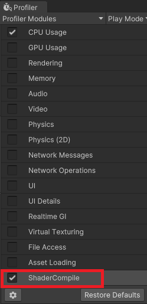
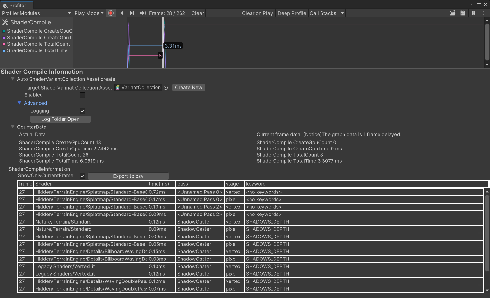

# ProfilerModuleForShaderCompile

[English](README.md) 

## このツールについて
このツールは ShaderCompileをProfilerで一覧できるようにしているProfilerの拡張Moduleです。 
また一覧表示するだけでなく、そのShaderCompile情報から自動的にShaderVariantCollectionアセットを作成するツールです。 
 
こちらは、実機上で発生する ShaderCompileを見たいと言ったときに使えるツールです。 
 
姉妹ツール「[UnityShaderVariantLoggerForEditor](https://github.com/wotakuro/UnityShaderVariantLoggerForEditor) 」もあります。 
こちらはEditorプレイだけで、アプリ内でどのようなShaderCompileが走るのかを把握したいときに利用します。 

## 利用方法
### インストールについて
Packagesフォルダ以下にコチラの中身を入れてください

### 有効化方法について
 
ProfilerのModuleに「ShaderCompile」があるので、コチラを有効にして利用します。

### 使い方

 

#### 1.Target ShaderVariant Collection
こちらにShaderVariantCollectionアセットを指定すると、Profilerの情報を元に勝手にShaderVariantを足していきます。 
Enabledのチェックを外すと自動書き込み機能をオフにすることが出来ます。

#### 2.Advanced 
ここではLogファイルの書き出しに関する設定が出来ます。 
Logは自動的に Library/profilermodule.shadercompile/logs フォルダへ書き出されます。

#### 3.Counter Data
そのフレームで行われたShaderCompileの回数を出します。 
ただShaderCompileのカウンターが1フレーム遅れてカウントされてしまいます。 
そのため、1フレーム先の情報をActualとして出しています。 
参考情報までに実際のカウンターデータも出しています。

#### 4.ShaderCompileInformation

Profilerから見つけたShaderCompileを全て一覧にして出しています。 
ShowOnlyCurrentFrameのチェックを入れると現在のフレームの情報のみ出します。 
 
また"Export to csv"をする事で Profiler中にある全てのフレームのShaderCompile情報をCSVファイルに書き出すことが可能になっています。

