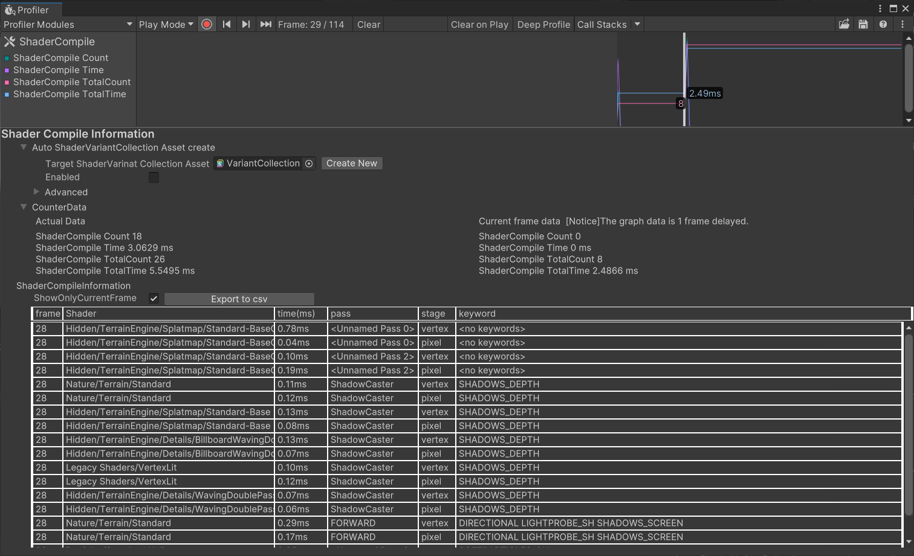

# ProfilerModuleForShaderCompile

[日本語はコチラ](README.ja.md) 

## About 
This tool is an extension module of the Profiler that allows ShaderCompile to be listed in the Profiler. 
This tool not only lists ShaderCompiles, but also automatically creates ShaderVariantCollection assets from the ShaderCompile information. 
 
This is a tool that can be used when you want to see the ShaderCompile that occurs on the actual device.
 
A sister tool, [UnityShaderVariantLoggerForEditor](https://github.com/wotakuro/UnityShaderVariantLoggerForEditor) is also available. 
This one is used when you want to keep track of what ShaderCompile is running in the application just for Editor play.
 

## How to use

### About installation
Please put this under the "Packages" folder.

### How to enabled
 
Enable the "Shader Compile" in the ProfilerModules.

### Screenshot and explaination

 

#### 1.Target ShaderVariant Collection
If you specify a ShaderVariantCollection asset here, the ShaderVariant will be added on its own based on the Profiler's information. 
Unchecking the "Enabled" checkbox will turn off the auto creation feature.

#### 2.Advanced 
You can disable log file creation here. 
Logs are automatically written to the Library/profilermodule.shadercompile/logs folder

#### 3.Counter Data
The number of ShaderCompiles performed in that frame is displayed 
However, the ShaderCompile counter is counted 1 frame delayed.  
Therefore, the information one frame ahead is output as an Actual.< br/ >
Current frame data is also shown for reference. 
#### 4.ShaderCompileInformation

All ShaderCompiles found from the Profiler are listed and brought out. 
If ShowOnlyCurrentFrame is checked, only information on the current frame will be shown. 
 
Also, "Export to csv" allows you to export the ShaderCompile information for all frames in the Profiler to a CSV file.
